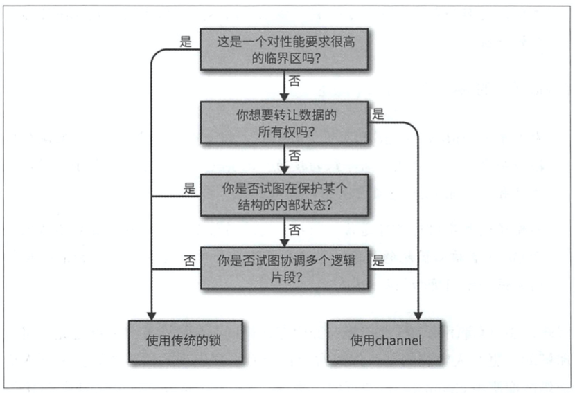

# 第2章 对你的代码建模：通信顺序进程

## 并发与并行的区别

> 并发属于代码，并行属于一个运行中的程序
>
> 并没有编写并行的代码，只有希望可以并行执行的并发代码。
>
> 并行是程序运行时的属性

## 什么是CSP

## Go语言的并发哲学

说明：

#### 转让数据的所有权

数据拥有所有者，并发程序安全就是保证同时只有一个并发上下文拥有数据的所有权。

转让数据所有权，将某个代码块产生的计算结果共享给其他代码。

channel可以解耦生产者与消费者，也可以组合各种并发代码。

#### 保护某个结构的内部状态

例如各种原子性的操作，对外隐藏了内部结构。

#### 试图协调多个逻辑片段

channel本质上比内存访问同步原语更具可组合性。

#### 对性能要求很高的临界区

并不意味着“为了高性能而使用mutex”。如果某个代码块是一个主要的性能瓶颈，那么使用mutex可能会有所帮助。

---

> Go语言的并发性哲学：追求简洁，尽量使用channel，并且认为goroutine的使用是无成本的

