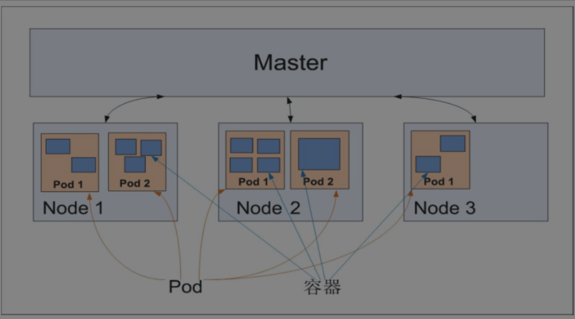
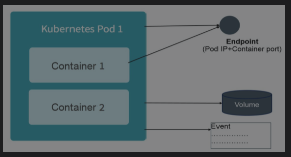
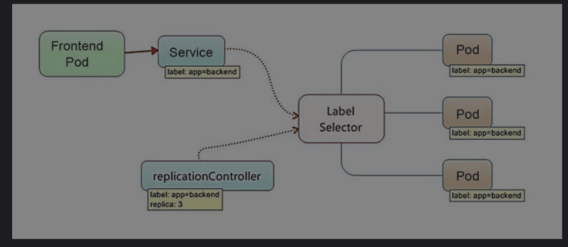

# 第1章 Kubernetes入门

## 1.1 Kubernets是什么

* 全新的基于容器技术的分布式架构领先方案
* 提供强大的自动化机制，降低系统后期的运维难度和运维成本
* 开放的开发平台
  * 对现有的编程语言、编程框架、中间件没有任何侵入性
* 完备的分布式系统支撑平台

Kubernetes是一个全新的基于容器技术的分布式架构解决方案，并且是一个一站式的完备的分布式系统开发和支撑平台。

### 基本知识

#### Service

sevice是分布式集群架构的核心，一个Service对象拥有如下关键特征：

* 拥有唯一指定的名称
* 拥有一个虚拟IP和端口号
* 能够提供某种远程服务能力
* 被映射到提供这种服务能力的一组容器应用上

#### Pod

* 把Service提供服务的一组进程放入容器中进行隔离
* 将每个服务进程包装到Pod中，使其成为在Pod中运行的一个Container

Pod运行在一个被称为节点（Node）的环境中，这个节点既可以是物理机，也可以是私有云或者公有云中的一个虚拟机。

在每个Pod中都运行着一个特殊的被称为Pause的容器，其他容器则为业务容器，共享Pause容器的网络栈和Volume挂载卷。

只有提供服务的那组Pod才会被映射为一个服务。

#### 集群管理

Kubernetes将集群中的机器划分为一个Master和一些Node。

Master上运行着集群管理相关的一组进程：

* kube-apiserver
* kube-controller-manager
* kube-scheduler

上述进程自动实现了整个集群的管理功能。

Node是集群中的工作节点，运行真正的应用程序，在Node上Kubernetes管理的最小运行单元是Pod。

Node上运行着

* kubelet
* kube-proxy

这些服务进程负责Pod的创建、启动、监控、重启、销毁，以及实现软件模式的负载均衡器。

## 1.2 为什么要用Kubernetes

好处：

* 轻装上阵开发复杂系统
* 全面拥抱微服务架构
* 可随时随地将系统整体“搬迁”到公有云上
* 内在的弹性扩容机制可轻松应对突发流量
* 横向扩容能力可提升竞争力

## 1.4 Kubernetes的基本概念和术语

Kubernetes中的大部分概念如Node、Pod、Replication Controller、Service等都可以被看作一种资源对象，几乎所有资源对象都可以通过Kubernetes提供的kubectl工具（或者API编程调用）执行增、删、改、查等操作并将其保存在etcd中持久化存储。

k8s通过跟踪对比etcd库里保存的“资源期望状态”与当前环境中的“实际资源状态”的差异来实现自动控制和自动纠错的高级功能。

#### apiVersion

Kubernetes平台采用了“核心+外围扩展”的设计思路，大部分常见的核心资源对象都归属于v1这个核心API。

#### annotations

为k8s每个资源对象都增加了类似数据库表里备注字段的通用属性`annotations`。随着k8s版本迭代，扩展字段可以稳定为固定字段。

重要资源对象：

### 1.4.1 Master

集群控制节点，每个Kubernetes集群里都需要有一个Master来负责整个集群的管理和控制，基本上Kubernetes的所有控制命令都发给Master，进行具体的执行过程。

Master通常占据一个独立的服务器，高可用情况下建议部署3台。

Master上运行着以下进程：

* Kubernetes API Server (kube-apiserver)
  * 提供HTTP Rest接口的关键服务进程，是k8s所有资源的增、删、改、查等操作的唯一入口，也是集群控制的入口进程
* Kubernetes Controller Manager (kube-controller-manager)
  * k8s中所有资源对象的自动化控制中心
* Kubernetes Scheduler (cube-scheduler)
  * 负责资源调度（Pod调度）的进程

另外，在Master上通常还需部署etcd服务。

### 1.4.2 Node

Node是Kubernetes集群中的工作负载节点，每个Node都会被Master分配一些工作负载（Docker容器），当某个Node宕机时，其上的工作负载会被Master自动转移到其他节点上。

每个Node上都运行着以下关键进程：

* kubelet：负责Pod对应的容器的创建、启停等任务，同时与Master密切协作，实现集群管理的基本功能
* kube-proxy：实现k8s Service的通信与负载均衡机制的重要组件
* Docker Engine：Docker引擎

#### kubelet

默认情况下，kubelet会向Master注册自己。

一旦Node被纳入集群管理范围，kubelet进程就会定时向Master汇报自身情况，便于Master实现高效均衡的资源调度策略。

### 1.4.3 Pod

每个Pod中包括“根容器”Pause容器，和一组紧密相关的用户业务容器。

* 引入业务无关并且不易死亡的Pause容器作为Pod的根容器，以其状态代表整个容器组的状态，易于判断容器整体是否不可用
* Pod中多个业务容器共享Pause容器的IP、Volumn

k8s为每个Pod都分配唯一的IP地址，称之为Pod IP，一个Pod里的多个容器共享Pod IP地址。

在Kubernetes里，一个Pod里的容器与另外主机上的Pod容器能够直接通信。

Pod的两种类型：

* 静态Pod
  * 没有被放在k8s的etcd存储中，而是被放在某个具体的Node上的具体文件中，并且只在此Node上启动、运行
* 普通Pod
  * 被创建后放入etcd存储，随后被k8s Master调度到某个具体的Node上并进行绑定，随后该Pod被对应的Node上的kubelet进程实例化一组相关的Docker容器并启动
  * Pod中某个容器停止时，k8s会自动检测到这个问题并重新启动此Pod中的所有容器
  * Pod所在Node宕机，就会将这个Node上的所有Pod重新调度到其他节点上



配置文件示例：

```yaml
apiVersion: v1
kind: Pod
metadata:
	name: myweb
	labels: 
		name: myweb
spec:
	containers:
	- name: myweb
	  image: kubeguide/tomcat-app:v1
	  resources:
	  	request:
	  		memory: "64Mi"
	  		cpu: "250m"
	  	limits:
	  		memory: "128Mi"
	  		cpu: "500m"
	  ports:
	  - containerPort: 8080
	  env:
	  - name: MYSQL_SERVICE_HOST
	    value: 'mysql'
	  - name: MYSQL_SERVICE_PORT
	    value: '3306'
```

* kind：资源类型，此处为Pod
* metadata：元数据
* spec：声明Pod中所包含的容器组
  * containerPort：指定容器进程启动的端口
  * Pod的IP加上containerPort组成一个新概念：Endpoint
  * Endpoint代表此Pod里的一个服务进程的对外通信地址

##### 计算资源

每个Pod都可以对其上能使用的服务器上的计算资源设置限额，当前可设置限额的计算资源有：

* CPU
  * 单位：千分之一CPU配额，用m表示
* Memory
  * 单位：字节

一个计算资源进行配额限定时需要设定以下两个参数：

* Requests：该资源的最小申请量，系统必须满足要求
* Limits：该资源最大允许使用的量，不能被突破，当容器试图使用超过这个量的资源时，可能会被Kubernetes“杀掉”并重启



### 1.4.4 Label

* 一个Label是一个key=value的键值对，其中key与value由用户自己指定
* Label可以被附加到各种资源对象上
* 一个资源对象可以定义任意数量的Label
* 同一个Label也可以被添加到任意数量的资源对象上
* Label通常在资源对象定义时确定，也可以在对象创建后动态添加或者删除

给某个资源对象定义一个Label，就相当于给它打了一个标签，随后可以通过Label Selector（标签选择器）查询和筛选拥有某些Label的资源对象，Kubernetes通过这种方式实现了类似SQL的简单又通用的对象查询机制。

Label Selector在Kubernetes中的重要使用场景：

* kube-controller进程通过在资源对象RC上定义的Label Selector来筛选要监控的Pod副本数量，使Pod副本数量始终符合预期设定的全自动控制流程
* kube-proxy进程通过Service的Label Selector来选择对应的Pod，自动建立每个Service到对应Pod的请求转发路由表，从而实现Service的智能负载均衡机制
* 通过对某些Node定义特定的Label，并且在Pod定义文件中使用NodeSelector这种标签调度策略，kube-scheduler进程可以实现Pod定向调度的特性

### 1.4.5 Replication Controller

定义了一个期望的场景，即声明某种Pod的副本数量在任意时刻都符合某个预期值。

RC的定义包括如下部分：

* Pod期待的副本数量
* 用于筛选Pod的Label Selector
* 当Pod的副本数量小于预期数量时，用于创建新Pod的Pod模板

定义了一个RC并将其提交到Kubernetes集群中后，Master上的ControllerManager组件就得到通知，定期巡检系统中当前存活的目标Pod，并确保目标Pod实例的数量刚好等于此RC的期望值，如果有过多的Pod副本在运行，系统就会停掉一些Pod，否则系统会再自动创建一些Pod。

可以说，通过RC，Kubernetes实现了用户应用集群的高可用性，并且大大减少了系统管理员在传统IT环境中需要完成的许多手工运维工作（如主机监控脚本、应用监控脚本、故障恢复脚本等）

### 1.4.6 Deployment

k8s在1.2版本中引入的新概念，用于更好地解决Pod的编排问题。

### 1.4.9 Service

#### 1.概述

k8s中每个Service其实就是经常提起的微服务架构中的一个微服务。



Kubernetes的Service定义了一个服务的访问入口地址，前端的应用（Pod）通过这个入口地址访问其背后的一组由Pod副本组成的集群实例，Service与其后端Pod副本集群之间则是通过Label Selector来实现无缝对接的。RC的作用实际上是保证Service的服务能力和服务质量始终符合预期标准。

运行在每个Node上的kube-proxy进程其实就是一个智能的软件负载均衡器，负责把对Service的请求转发到后端的某个Pod实例上，并在内部实现服务的负载均衡与会话保持机制。

每个Service都被分配了一个全局唯一的虚拟IP地址，这个虚拟IP被称为Cluster IP。这样一来，每个服务就变成了具备唯一IP地址的通信节点，服务调用就变成了最基础的TCP网络通信问题。

Service一旦被创建，k8s就会自动为它分配一个可用的Cluster IP，而且在Service的整个生命周期内，其Cluster IP不会发生改变。

如此，便可建立Service Name到Service Cluster IP的DNS域名映射，巧妙的实现了服务发现。

