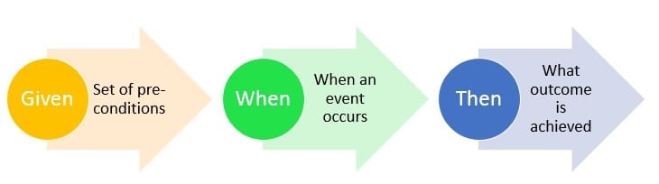

# 第9章 单元测试

## 9.1 TDD三定律

1. 在编写不能通过的单元测试前，不可编写生产代码
2. 只可编写刚好无法通过的单元测试，不能编译也算不通过
3. 只可编写刚好足以通过当前失败测试的生产代码

## 9.2 保持测试整洁

测试代码和生产代码一样重要，它该像生产代码一般保持整洁。

* 没有测试，则会失去保证生产代码可扩展的一切要素
* 测试使得改动变得可能

## 9.3 整洁的测试

最重要的要素：**可读性**

如何做到可读性？**明确、简洁、足够的表达力**

测试模式之**构造-操作-检验**(BUILD-OPERATE-CHECK)

1. 构造测试数据
2. 操作测试数据
3. 检验操作是否得到期望结果

### 9.3.1 面向特定领域的测试语言

测试时，可根据所要测试的内容，包装一套API，既可帮助程序员编写自己的测试，又提高测试代码的可读性。

*一个测试类即可定义为一个特定领域*

### 9.3.2 双重标准

测试代码应当**简单、精悍、足具表达力，和生产代码一样有效**

## 9.4 每个测试一个断言

可利用模板方法模式，将`given/when`部分放到基类中，将then部分放到派生类中，消除代码重复问题。

比起每个测试一个断言，最好的说法应该是“单个测试中的断言数量应该最小化”。

#### 每个测试一个概念

最佳规则

> 尽可能减少每个概念的断言数量，每个测试函数只测试一个概念

## 9.5 F.I.R.S.T

整洁测试还应遵守如下五条规则：

1. 快速(Fast)
   1. 测试应足够快，以保证可在较短的时间内被频繁运行
2. 独立(Independent)
   1. 测试应相互独立，互不干扰
3. 可重复(Repeatable)
   1. 测试应当在任何环境中通过，包括开发环境、测试环境、生产环境
   2. 如此，则需要在构建测试时尽可能减少对环境，第三方的依赖
4. 自足验证(Self-Validating)
   1. 测试应该有布尔值输出，无论是通过或失败
   2. 不应通过日志输出等人工手段确认测试是否通过
5. 及时(Timely)
   1. 测试应及时编写，单元测试应该恰好在使其通过的生产代码之前编写
   2. 如此，避免某些代码难以测试

## 9.6 小结

